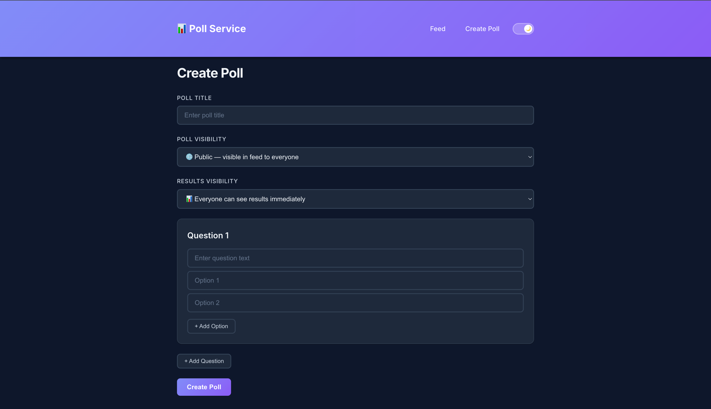
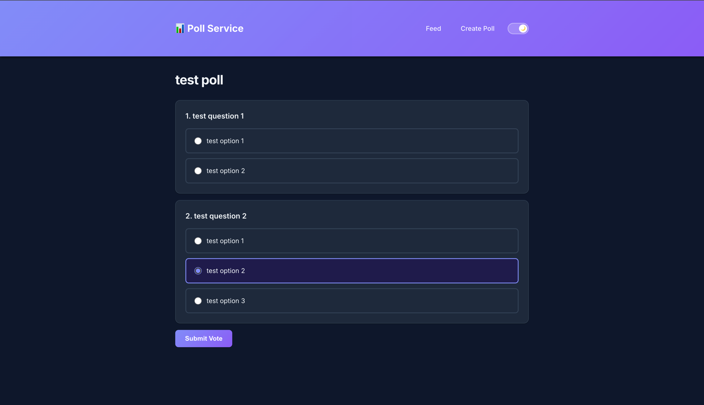
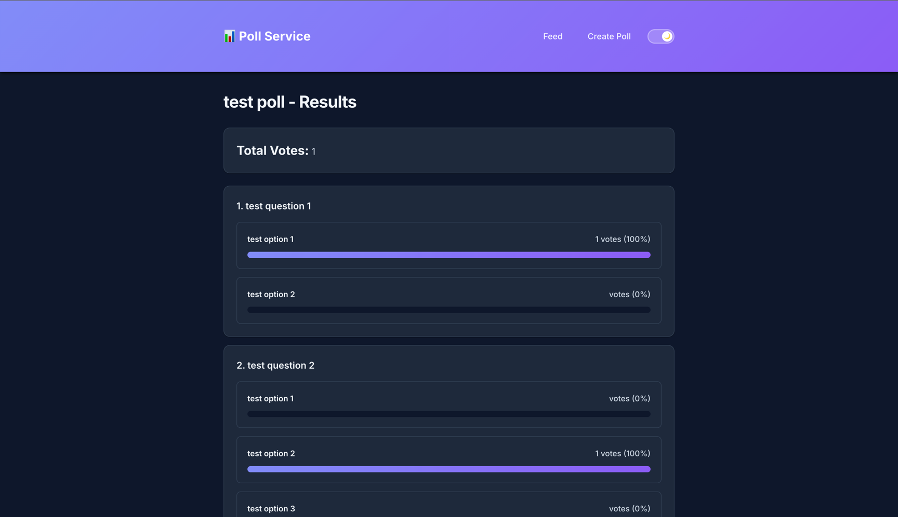

# 📊 Poll Service

A simple and intuitive poll creation and sharing service built with Go, React, and PostgreSQL.

## Demo

### Screenshots

**Create Poll**


**Vote on Poll**


**View Results**


**Poll Feed**
docs/screenshots/poll-feed.png)

## Context

### End Users
- Regular internet users, students, teams, content creators
- Anyone who needs to quickly gather opinions from an audience

### Problem
- No simple way to quickly create polls and collect answers in one place
- Need to share polls (including via links) and get results organized

### Solution
Poll Service allows users to quickly create polls, share them via unique links, and view results in a clean, intuitive interface.

## Features

### Implemented ✅
- Create polls with multiple questions and options
- Share polls via unique links
- Vote on polls (single choice per question)
- View results with vote counts and percentages
- Poll feed showing all public polls
- Result visibility controls:
  - Always visible
  - Visible after voting
  - Author-only
- Cookie-based voter identification (prevents duplicate votes)
- Responsive UI design

### Not Yet Implemented 🚧
- Telegram bot integration
- User authentication
- Poll search functionality
- Poll editing
- Real-time result updates
- Multiple choice questions (checkboxes)
- Comments on polls

## Usage

### Creating a Poll
1. Navigate to "Create Poll"
2. Enter poll title
3. Choose result visibility setting
4. Add questions (minimum 1)
5. Add options for each question (minimum 2)
6. Click "Create Poll"
7. Share the generated link with participants

### Voting on a Poll
1. Open the poll link
2. Select your answers for each question
3. Click "Submit Vote"
4. View results (based on poll's visibility settings)

### Viewing Results
- Results show vote counts and percentages
- Progress bars visualize the distribution
- Access depends on poll's visibility settings

## Testing

### Run All Tests
```bash
# Run the test script
./test.sh

# Or run tests separately
# Go backend tests
go test ./... -v -cover

# React frontend tests
cd frontend
CI=true npm test
```

### Test Coverage
- **Backend (Go)**: ~70-75% coverage
  - Service layer: 17 tests covering poll creation, voting, results visibility
  - Handler layer: 8 tests covering all API endpoints
  - Config: 5 tests covering environment variable loading
  - Middleware: 4 tests covering voter ID cookie management

- **Frontend (React)**: Component tests for UI rendering
  - CreatePoll component rendering tests
  - Form validation tests

### Test Structure
```
├── internal/service/poll_test.go      # Business logic tests
├── internal/handler/poll_test.go      # HTTP handler tests
├── pkg/config/config_test.go          # Configuration tests
└── pkg/middleware/voter_id_test.go    # Middleware tests
```

## Deployment

### Requirements
- Docker and Docker Compose
- Ubuntu 24.04 (or any Linux with Docker support)

### What Should Be Installed
```bash
# Install Docker
curl -fsSL https://get.docker.com -o get-docker.sh
sudo sh get-docker.sh

# Install Docker Compose (usually included with Docker)
sudo apt-get install docker compose-plugin
```

### Step-by-Step Deployment

1. **Clone the repository**
```bash
git clone <repository-url>
cd inno-se-toolkit-pet
```

2. **Configure environment variables**
```bash
cp .env.example .env
# Edit .env and change the COOKIE_SECRET to a secure random value
```

3. **Start all services**
```bash
docker compose up -d
```

4. **Check services are running**
```bash
docker compose ps
```

5. **Access the application**
- Frontend: http://localhost:3000
- Backend API: http://localhost:8080
- PostgreSQL: localhost:5432

6. **View logs**
```bash
docker compose logs -f
```

7. **Stop services**
```bash
docker compose down
```

8. **Stop and remove volumes**
```bash
docker compose down -v
```

### Architecture

```
┌─────────────┐
│  Frontend   │ (React + Nginx, Port 3000)
│  (Port 80)  │
└──────┬──────┘
       │
       │ /api/*
       ▼
┌─────────────┐
│   Backend   │ (Go + chi, Port 8080)
└──────┬──────┘
       │
       ▼
┌─────────────┐
│ PostgreSQL  │ (Port 5432)
│   (Volume)  │
└─────────────┘
```

### Components

- **Backend**: Go REST API with chi router
- **Frontend**: React SPA with TypeScript
- **Database**: PostgreSQL 16 with persistent volume
- **Reverse Proxy**: Nginx serves frontend and proxies API requests

### Environment Variables

| Variable | Description | Default |
|----------|-------------|---------|
| `DB_HOST` | PostgreSQL host | `localhost` |
| `DB_PORT` | PostgreSQL port | `5432` |
| `DB_USER` | Database user | `postgres` |
| `DB_PASSWORD` | Database password | `postgres` |
| `DB_NAME` | Database name | `polls` |
| `SERVER_PORT` | Backend server port | `8080` |
| `COOKIE_SECRET` | Secret for voter cookies | `super-secret-key-change-in-production` |

### API Endpoints

| Method | Endpoint | Description |
|--------|----------|-------------|
| `GET` | `/health` | Health check |
| `GET` | `/api/polls` | Get public polls feed |
| `POST` | `/api/polls` | Create a new poll |
| `GET` | `/api/polls/{id}` | Get poll by ID |
| `POST` | `/api/polls/{id}/vote` | Submit vote for poll |
| `GET` | `/api/polls/{id}/results` | Get poll results |

## License

MIT License - see LICENSE file for details.
